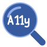
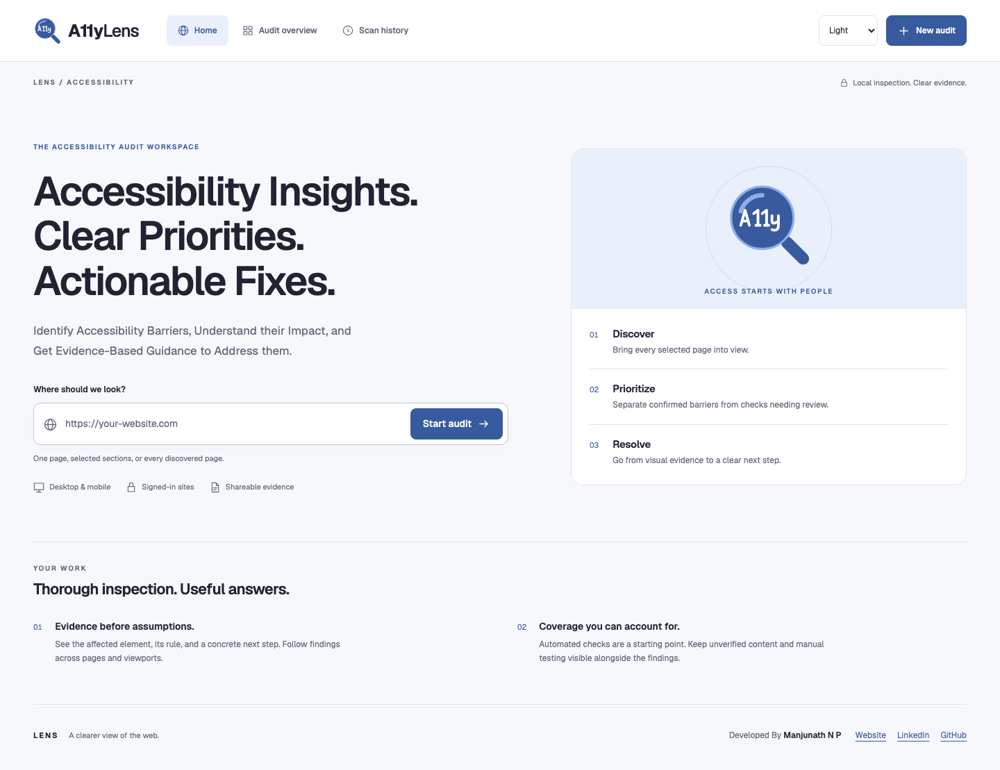
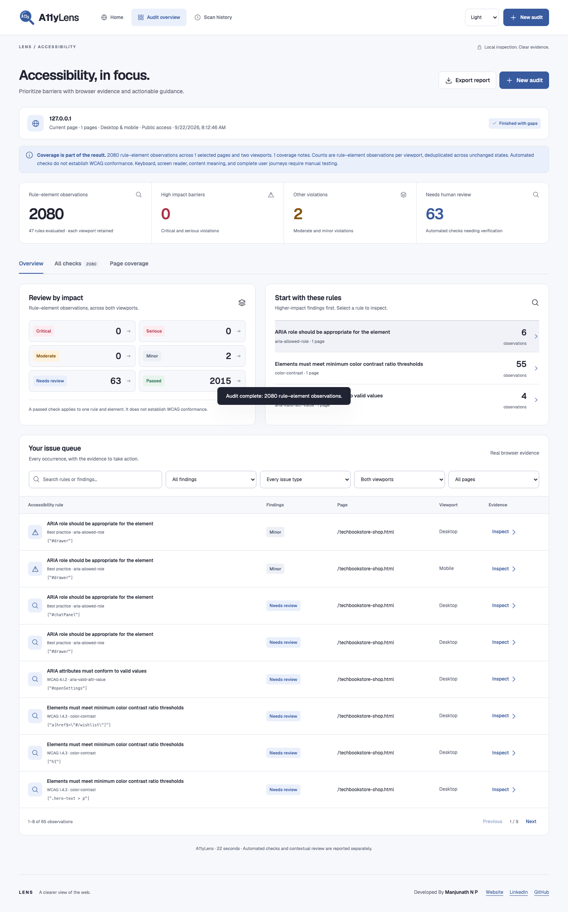
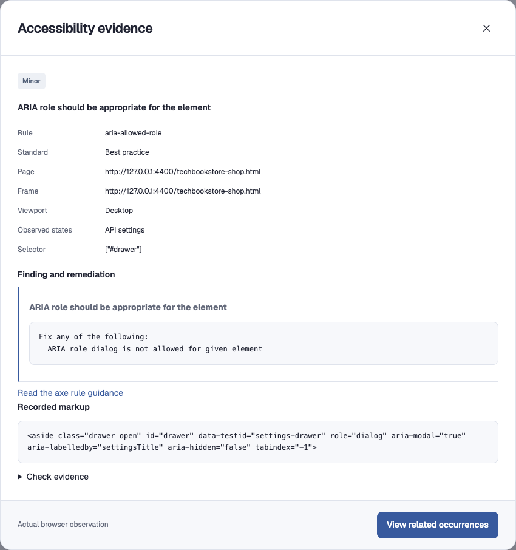
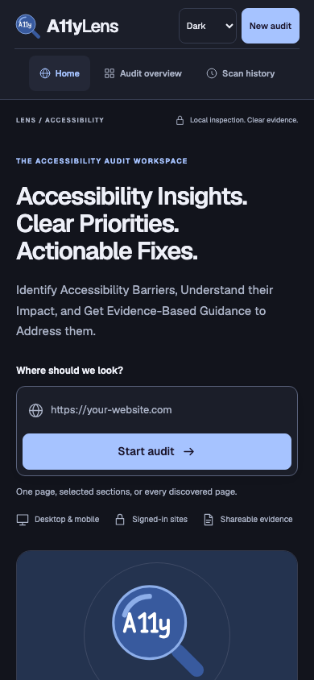
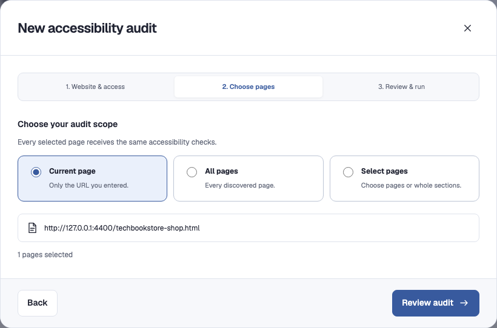
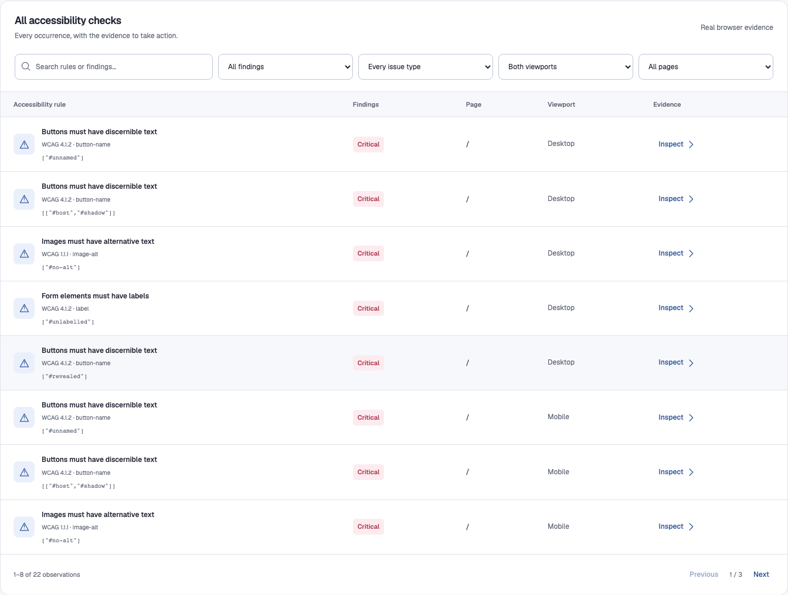
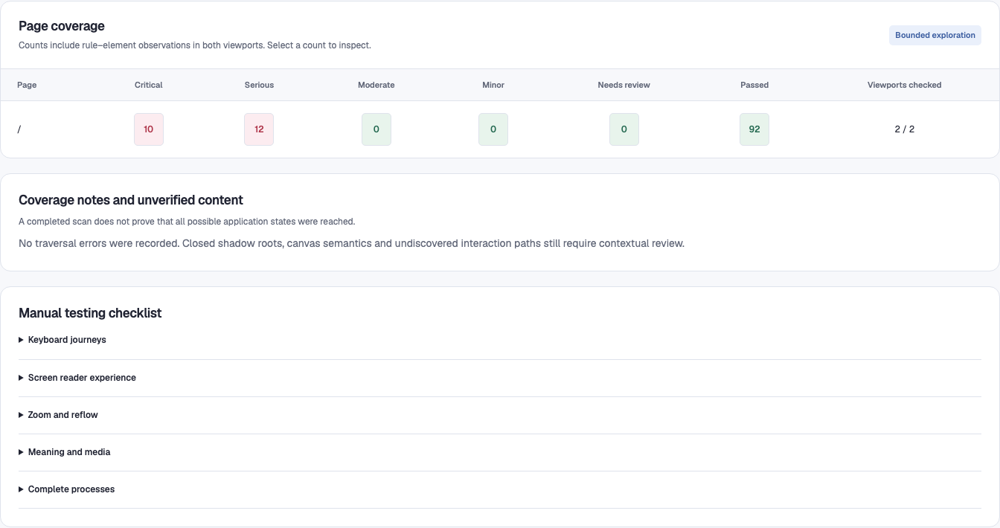
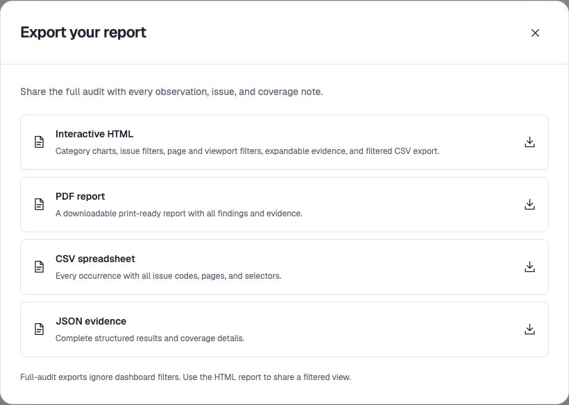
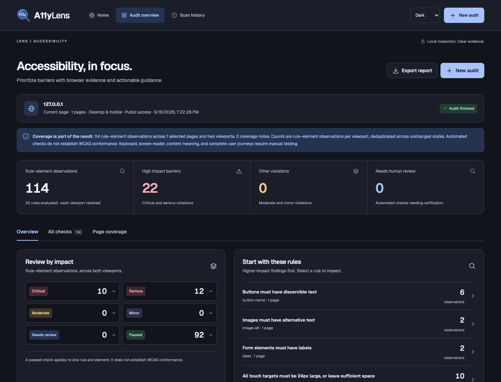

<div align="center">
  
  <h1>A11yLens</h1>
  <p><strong>Accessibility Insights. Clear Priorities. Actionable Fixes.</strong></p>
  <p>Identify Accessibility Barriers, Understand their Impact, and Get Evidence-Based Guidance to Address them.</p>
  <p><a href="#installation">Installation</a> · <a href="#how-to-use-a11ylens">How to use</a> · <a href="#reports">Reports</a> · <a href="#testing">Testing</a> · <a href="#product-demo">Product demo</a></p>
  <sub>Version 1.1.0 · Node.js 20+ · Playwright with Chromium · axe-core</sub>
  <p>
    <a href="CHANGELOG.md"></a>
    <a href="#requirements"></a>
    <a href="#testing"></a>
    <a href="docs/demo/index.html"></a>
  </p>
</div>

---

## About A11yLens

A11yLens is a local accessibility inspection workspace for developers, testers, and accessibility reviewers. It opens web pages in a real browser, runs axe-core checks, and connects each finding to the affected element, its context, and rule-specific guidance.

Part of the LENS collection alongside LinkLens and [ImageLens](https://github.com/manjunathnp/ImageLens), it brings page selection, severity triage, element evidence, coverage, and report sharing into one workflow. It supports public websites and browser-based sign-in for authenticated pages.

Automated findings provide a strong starting point for accessibility review and work alongside keyboard, screen-reader, content, and journey testing.

## The LENS Trio

The LENS Trio shares a visual system and an evidence-first approach across three focused quality tools.

| Product | Focus | Repository |
| --- | --- | --- |
| **A11yLens** | Accessibility audit evidence, issue triage, element inspection, and coverage review | [github.com/manjunathnp/A11yLens](https://github.com/manjunathnp/A11yLens) |
| **LinkLens** | Link integrity, destination verification, access conditions, and navigation evidence | [github.com/manjunathnp/LinkLens](https://github.com/manjunathnp/LinkLens) |
| **ImageLens** | Image integrity, responsive resources, text alternatives, and visual evidence | [github.com/manjunathnp/ImageLens](https://github.com/manjunathnp/ImageLens) |

## Screenshots

### Home



### Accessibility Overview



<table>
  <tr><td width="70%"><strong>Element Evidence</strong></td><td width="30%"><strong>Mobile View</strong></td></tr>
  <tr><td></td><td></td></tr>
</table>

<details>
<summary>More Screenshots: Scope, Issue Queue, Coverage, Exports, and Dark Mode</summary>

### Page Selection


### Issue Queue


### Coverage


### Exports


### Dark Mode


</details>

Screenshots show a fresh scan of **Tech Book Store**, a local practice storefront, at `http://127.0.0.1:4400/techbookstore-shop.html`. The public catalog was reviewed in desktop and mobile viewports using seeded book data. See [capture provenance](docs/screenshots/capture-provenance.json) and the [exported report](docs/demo/tech-book-store-report.html).

The captured A11yLens run records 2,080 rule–element observations. Minor violations and needs-review observations are shown separately from passes.

## Main Features

- Scan the current page, discovered pages, or selected same-origin URLs.
- Sign in directly in a browser window for authenticated inspection.
- Inspect desktop (1366 × 900) and mobile (390 × 844) viewports.
- Review critical, serious, moderate, and minor violations separately from results needing review.
- Filter observations and inspect affected selectors, markup, frames, observed states, WCAG references, and rule-specific guidance.
- Inspect open shadow DOM and accessible frames; explore supported disclosures and tabs within explicit bounds.
- Review coverage gaps and a manual-testing checklist.
- Export interactive HTML, PDF, CSV, and JSON reports.
- Use system, light, or dark themes and responsive layouts.
- Reconnect to active jobs after refresh while the server remains running; retain the latest ten scans in browser storage.

## Requirements

- Node.js 20 or newer and npm
- A platform supported by Playwright Chromium
- A graphical desktop session for browser-based sign-in

## Installation

```bash
git clone https://github.com/manjunathnp/A11yLens.git
cd A11yLens
npm ci
npx playwright install chromium
npm start
```

Open [http://127.0.0.1:4200](http://127.0.0.1:4200). There is no frontend build step. The Chromium installation downloads the browser used by the scanner and usually only needs repeating when the Playwright version changes.

On Linux, if Chromium reports missing system libraries, install its dependencies with `npx playwright install --with-deps chromium`.

To use another port on macOS/Linux:

```bash
PORT=4201 npm start
```

In PowerShell: `$env:PORT=4201; npm start`.

The server binds to `127.0.0.1`, keeping the scanning workspace on your computer.

## How to Use A11yLens

1. Enter a website or page URL.
2. Choose public access or sign in through the browser opened by A11yLens.
3. For authenticated access, finish sign-in on the target website, then return and confirm the session.
4. Choose the current page, discovered pages, or a selected set. Review scope before starting.
5. Review impact and prioritized rules, filter the issue queue, and open element evidence.
6. Check coverage gaps and manual-review tasks alongside automated results.
7. Export the findings, investigate fixes, and scan again after changes.

Credentials are entered on the target website, not in the A11yLens dashboard. Use sites and accounts you are authorized to test.

## Checks and Interpretation

| Area | What A11yLens provides |
| --- | --- |
| Accessibility rules | axe-core checks tagged `wcag2a`, `wcag2aa`, `wcag21a`, `wcag21aa`, `wcag22aa`, and `best-practice` |
| Impact | Critical, serious, moderate, and minor violations using the engine's impact classification |
| Needs review | Incomplete results kept separate from automatic failures and passes |
| Evidence | Rule, selector, markup, page, frame, viewport, observed states, and remediation guidance |
| Coverage | Navigation outcomes, frame checks, exploration scope, and manual-review guidance |
| Browser states | Supported disclosures, tabs, scrolling, open shadow DOM, and accessible frames |

Counts represent rule–element observations per viewport. Unchanged results across explored states are merged while retaining their observed state names. Each pass remains connected to its rule, element, page, and viewport. The outcome chart summarizes the recorded observations, while coverage and manual-review guidance provide the wider evaluation context. Best-practice checks are distinguished from WCAG rules. Reports record the engine version and tags.

## Reports

| Format | Best for |
| --- | --- |
| **HTML** | Self-contained interactive review with filters, expandable evidence, and filtered CSV download |
| **PDF** | Printable or shareable report |
| **CSV** | Spreadsheet review and sorting |
| **JSON** | Complete structured scan data for another workflow |

Full exports include all observations regardless of dashboard filters. Reports can contain page URLs and DOM evidence; review their contents before sharing. CSV export protects spreadsheet-formula prefixes. PDF generation disables scripts and blocks network requests. Newly generated HTML/PDF reports include developer attribution.

## Privacy and Local Storage

- The app listens only on loopback and checks incoming origin and local request headers.
- Authentication sessions retain cookies and browser storage in server memory, expire after 30 minutes of inactivity, and close when the workflow ends.
- The scanner reuses the confirmed browser tab to retain sessionStorage and reloads between viewport checks.
- Scan jobs/results are held in memory with a bounded job history; restarting the server loses active jobs.
- The browser stores the latest ten audits. Storage failures show an export reminder.
- Scanning sends browser requests to the target site and its resources.

## Scan Scope and Coverage

- Each run can discover up to 200 same-origin pages and maintain a queue of up to 3,000 URLs.
- Per-page exploration includes up to 24 scroll steps and 16 supported interactions, keeping larger reviews predictable.
- Page navigation uses a 20-second response window and records pages that need follow-up.
- “All pages” represents every page discovered during the selected run, with the selected URLs and viewport coverage preserved in the report.
- Mobile inspection adds a 390 × 844 viewport perspective; teams can extend it with physical-device and cross-browser testing when those environments matter.
- The manual-review checklist helps teams continue with keyboard, screen-reader, content, media, and complete-journey evaluation.
- Safe traversal focuses on read-oriented interactions and avoids forms and action-oriented controls, making it suitable for authorized review environments.

## Testing

Run these in order: the design suite uses the fixture report generated by the integration suite.

```bash
npm test
npm run test:scenarios
npm run test:design
```

The integration suite covers real axe findings, viewport coverage, shadow DOM, disclosures, deduplication, navigation failures, setup, filtering, evidence, exports, cancellation, and dashboard/report accessibility checks. Scenario tests cover authentication storage, password settings, redirects, refresh recovery, closed-session recovery, and storage exhaustion. Design checks cover themes, responsive layouts, keyboard tabs, focus restoration, enlarged text, and system preferences.

Artifacts go to ignored `test-output/`. See [scenario validation](VALIDATION.md), [design validation](DESIGN-VALIDATION.md), and [technical notes](docs/TECHNICAL-NOTES.md) for supporting detail. The automated suites and manual review guidance complement one another.

## Product Demo

The [standalone product demo](docs/demo/README.md) includes a home-first presentation, a six-step interactive screenshot tour, dark and mobile views, and the Tech Book Store report. Open `docs/demo/index.html` locally or serve the folder with a static web server.

## Project Files

```text
A11yLens/
├── app.js                  # Interface and report generation
├── server.js               # Local server, sessions, and scan jobs
├── index.html              # App entry point
├── styles.css              # App styles
├── lens-tokens.css         # Shared LENS design tokens
├── theme.js                # Theme preferences
├── src/
│   ├── authentication.js   # Authentication state checks
│   ├── browser.js          # Browser lifecycle and page discovery
│   └── scanner.js          # axe-core inspection and evidence
├── tests/                  # Integration and design suites
├── validation/             # Unexpected workflow scenarios
├── brand/                  # A11y lens mark
├── assets/fonts/           # Bundled Geist and its license
└── docs/
    ├── screenshots/        # Actual app captures and provenance
    └── demo/               # Standalone website showcase
```

## Development

Built with HTML, CSS, JavaScript, Node.js, Playwright, Chromium, and axe-core. The rules engine is axe-core; A11yLens supplies the surrounding scope, scanning, triage, evidence, recovery, and reporting workflow.

## Release History

See [CHANGELOG.md](CHANGELOG.md).

## License

Copyright © 2026 Manjunath N P. All rights reserved. See [LICENSE.md](LICENSE.md). Dependencies and bundled fonts retain their respective licenses.
